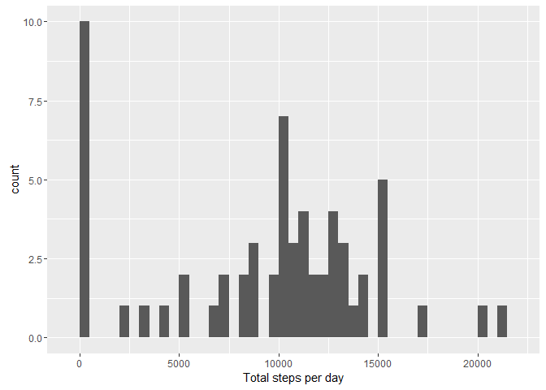
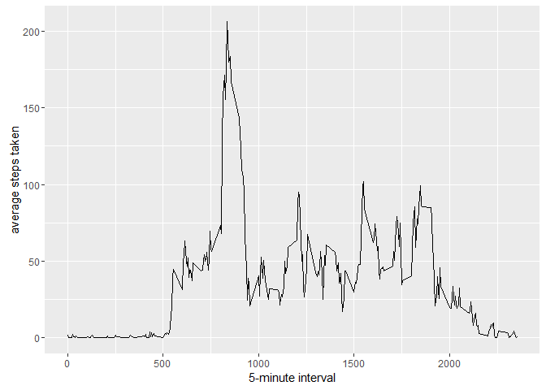
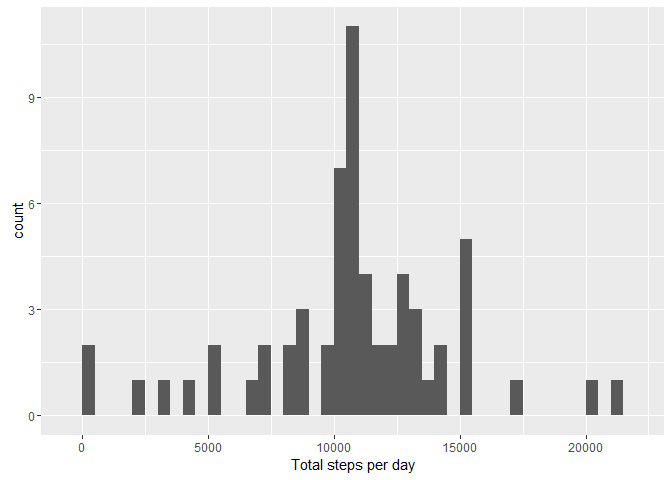

# Repeatable Research Project 1
Chris Horvath  
January 9, 2016  


## Load Data

```r
setwd("D://data//reproducable_research//RepData_PeerAssessment1")


unzip(zipfile="activity.zip")
data <- read.csv("activity.csv")
```

## Plot Histogram of total steps by day

```r
# find total steps
library(ggplot2)
total_steps <- tapply( data$steps,data$date, FUN=sum, na.rm=TRUE)


qplot(total_steps, xlab='Total steps per day', binwidth=500)
```

\

## Mean and Median of total steps by date

```r
mean(total_steps, na.rm=TRUE)
```

```
## [1] 9354.23
```

```r
median(total_steps, na.rm=TRUE)
```

```
## [1] 10395
```

## Plot time series

```r
library(ggplot2)
avg_steps_interval <- aggregate(x=list(steps=data$steps), by=list(interval=data$interval),FUN=mean, na.rm=TRUE)
ggplot(data=avg_steps_interval, aes(x=interval, y=steps)) +  geom_line() +  xlab("5-minute interval") + ylab("average steps taken")
```

\

## Max step interval

```r
avg_steps_interval[which.max(avg_steps_interval$steps),]
```

```
##     interval    steps
## 104      835 206.1698
```

## Missing data points

```r
missing <- is.na(data$steps)
# How many missing
table(missing)
```

```
## missing
## FALSE  TRUE 
## 15264  2304
```

## Replace missing data with avg 5-min interval and create new dataset

```r
clean_na <- function(steps, interval) {
  clean <- NA
  if (!is.na(steps))
    clean <- c(steps)
  else
    clean <- (avg_steps_interval[avg_steps_interval$interval==interval, "steps"])
  return(clean)
}
clean_data <- data
clean_data$steps <- mapply(clean_na, clean_data$steps, clean_data$interval)
```

## Plot Histogram of total steps by day with mean and median using clean data

```r
ctotal_steps <- tapply(clean_data$steps, clean_data$date, FUN=sum)
qplot(ctotal_steps, xlab='Total steps per day', binwidth=500)
```

\

```r
mean(ctotal_steps)
```

```
## [1] 10766.19
```

```r
median(ctotal_steps)
```

```
## [1] 10766.19
```

## Add weekday / weekend indicator to clean dataset

```r
weekday_weekend <- function(date) {
  day <- weekdays(date)
  if (day %in% c("Monday", "Tuesday", "Wednesday", "Thursday", "Friday"))
    return("weekday")
  else if (day %in% c("Saturday", "Sunday"))
    return("weekend")
  else
    stop("invalid date")
}
clean_data$date <- as.Date(clean_data$date)
clean_data$day <- sapply(clean_data$date, FUN=weekday_weekend)
```

## Panel Plot of 5-minute interval for both weekday and weekend

```r
avg_steps_interval <- aggregate(steps ~ interval + day, data=clean_data, mean)
ggplot(avg_steps_interval, aes(interval, steps)) + geom_line() + facet_grid(day ~ .) +
  xlab("5-minute interval") + ylab("Number of steps")
```

\
